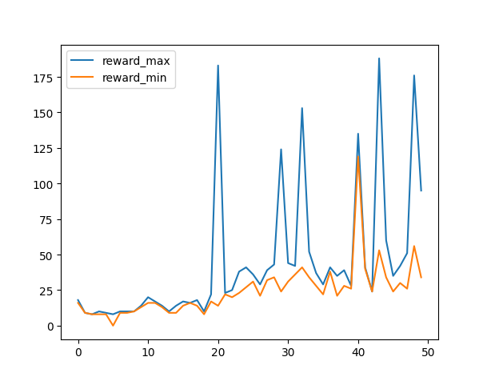

# LLM Game Agent (inverted pendulum)

这是一个简单的使用LLM Agent控制倒立摆的实验性项目，目的是探索LLM在使用in-Context Learning处理序列任务的能力，模型仅提供一种思路，欢迎大家提出更多有趣的想法。

## 运行环境

运行代码所需要的依赖包已经打包到requirements.txt中，使用以下命令进行安装

```
pip install requirements.txt
```

## 运行

国内用户推荐使用download_model.py下载模型，模型下载完成后会在控制台打印模型的路径。
需要修改的为：
```
model_checkpoint = "qwen/Qwen-7B"     # 进入modelscope官网选择模型
cache_dir = "./"                      # 下载路径
```
直接运行代码
```
python download_model.py
```

对于有能力直接访问huggingface的用户，可以直接运行agent.py

```
python agent.py --model_path 上一步下载模型的路径或是huggingface官网的模型名 --epoch 50 --episode_num 2 --episode_length 200 --render True
```

日志以json的方式存储在log.json中，可以通过运行record.py获取默认日志，或者在agent.py中添加想要记录的内容在epoch循环结束后绘制曲线。

## 运行日志

这里展示了一次50个epoch的记录，可以看到模型具备了一定的学习能力，但是依然存在不足，同时最终的收敛效果极大的依赖了初始状态以及大模型的性能，序列的组织形式也有待讨论。


